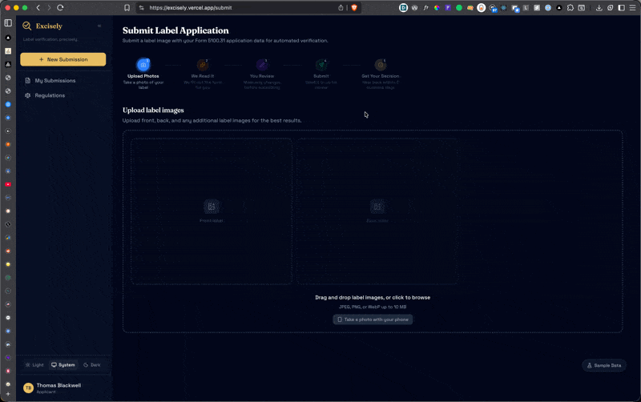

#  Excisely

**Label verification, precisely.**



AI-powered alcohol label verification for TTB labeling specialists. Compares uploaded label images against COLA application data (Form 5100.31) using OCR + field classification, with field-by-field comparison and optional annotated image overlays.

**Local-first** — works out of the box with zero cloud API keys. Cloud AI (Google Cloud Vision + OpenAI GPT-4.1) is opt-in for higher accuracy and bounding box overlays.

**[Live app](https://excisely.vercel.app)** | **[Submission guide](./SUBMISSION.md)** — walkthrough, screenshots, and interesting scenarios to try

> **Why "Excisely"?** In 1791, Alexander Hamilton created the excise tax on whiskey — the origin of federal alcohol regulation and the direct ancestor of TTB. "Excisely" blends "excise" with "precisely." [Full story](./docs/naming.md)

## Quick Start

```bash
git clone https://github.com/ryparker/excisely.git && cd excisely
yarn install
cp .env.example .env.local   # defaults work — no API keys needed
docker compose up -d          # start local Postgres
yarn db:push && yarn db:seed  # create tables + seed users/applicants/settings
yarn dev                      # http://localhost:3000
```

### Prerequisites

- Node.js 22+ and Yarn
- Docker (OrbStack or Docker Desktop) — for local Postgres

### Test Accounts

| Role       | Email                         | Password      |
| ---------- | ----------------------------- | ------------- |
| Specialist | sarah.chen@ttb.gov            | specialist123 |
| Applicant  | labeling@oldtomdistillery.com | applicant123  |

## How It Works

1. **Applicant uploads label images and fills in application data** — or, with Cloud AI enabled, the form is auto-filled from OCR in ~3-5s
2. **Applicant reviews and submits** — gets instant AI verification (approved, needs correction, etc.)
3. **Specialist opens the submission** — analysis is already done. Field comparison and the AI's recommendation are ready. They approve or override.

For bulk workflows, applicants can upload a CSV + images via **Batch Upload** to submit up to 50 applications at once. Specialists can batch-approve high-confidence labels from the dashboard.

The specialist never waits for AI. The applicant gets instant feedback.

### Field Comparison

Each extracted field is compared using a field-appropriate strategy:

| Field           | Strategy    | Example                            |
| --------------- | ----------- | ---------------------------------- |
| Health Warning  | Exact match | Case-sensitive, word-for-word      |
| Brand Name      | Fuzzy match | "STONE'S THROW" = "Stone's Throw"  |
| Alcohol Content | Normalized  | "45% Alc./Vol. (90 Proof)" = "45%" |
| Net Contents    | Normalized  | "750 mL" = "750ml" = "0.75L"       |

Results show character-level diff highlighting. With Cloud AI enabled, color-coded bounding box overlays (green = match, red = mismatch) are added, and clicking a field zooms the image to that region.

## Stack

| Layer     | Technology                                                                    |
| --------- | ----------------------------------------------------------------------------- |
| Framework | Next.js 16 (App Router, RSC-first, Turbopack)                                 |
| Language  | TypeScript (strict mode)                                                      |
| Styling   | Tailwind CSS v4 + shadcn/ui                                                   |
| Database  | Drizzle ORM + Postgres (local Docker or Neon)                                 |
| Storage   | Local filesystem (default) or Vercel Blob                                     |
| AI        | Tesseract.js OCR (default) or Google Cloud Vision + OpenAI GPT-4.1 via AI SDK |
| Auth      | Better Auth v1.4 (specialist + applicant roles)                               |
| Testing   | Vitest (625+ tests) + Playwright                                              |

## Commands

```bash
yarn dev                # Dev server (Turbopack)
yarn build && yarn start # Production build + serve
yarn lint               # ESLint
yarn test               # Vitest watch mode
yarn test:e2e           # Playwright E2E
yarn db:seed            # Seed users, applicants, and settings
yarn db:studio          # Drizzle Studio (web UI)
```

## Environment Variables

Only `DATABASE_URL`, `BETTER_AUTH_SECRET`, and `BETTER_AUTH_URL` are required. Everything else enables optional cloud features.

```bash
# Required
DATABASE_URL=                        # Local Docker (default in .env.example) or Neon
BETTER_AUTH_SECRET=                   # Session secret (openssl rand -hex 32)
BETTER_AUTH_URL=                      # App URL (http://localhost:3000 in dev)

# Optional — Cloud AI (add these to enable Cloud AI pipeline)
OPENAI_API_KEY=                      # OpenAI API key
GOOGLE_APPLICATION_CREDENTIALS=      # Path to GCP service account JSON (local dev)
GOOGLE_APPLICATION_CREDENTIALS_JSON= # GCP SA JSON content (Vercel deployment)

# Optional — Cloud Storage (add to use Vercel Blob instead of local filesystem)
BLOB_READ_WRITE_TOKEN=               # Vercel Blob storage token
```

## Documentation

| Document                                       | Description                                                    |
| ---------------------------------------------- | -------------------------------------------------------------- |
| **[SUBMISSION.md](./SUBMISSION.md)**           | **Start here** — walkthrough, screenshots, scenarios           |
| [docs/architecture.md](./docs/architecture.md) | System diagrams, data flow, DB schema                          |
| [docs/ai-pipelines.md](./docs/ai-pipelines.md) | AI pipeline deep dive — 5 pipelines, models, comparison engine |
| [docs/cloud-ai.md](./docs/cloud-ai.md)         | Cloud AI features — bounding boxes, AI pre-fill, costs         |
| [docs/decisions.md](./docs/decisions.md)       | 26 engineering decisions with rationale                        |
| [docs/production.md](./docs/production.md)     | Production readiness gaps (security, scale, FedRAMP)           |
| [docs/changelog.md](./docs/changelog.md)       | What changed and why                                           |

## License

Built as a take-home assessment. Not licensed for production use.
