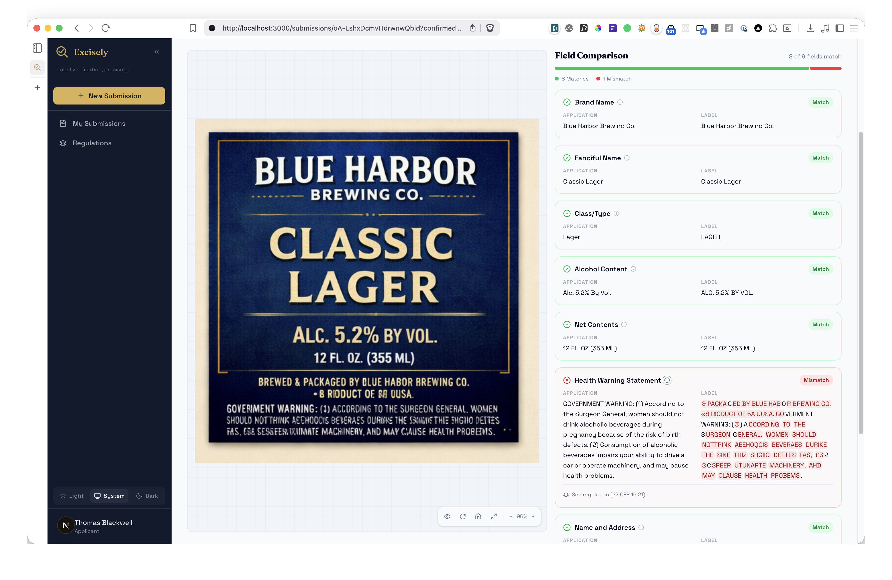
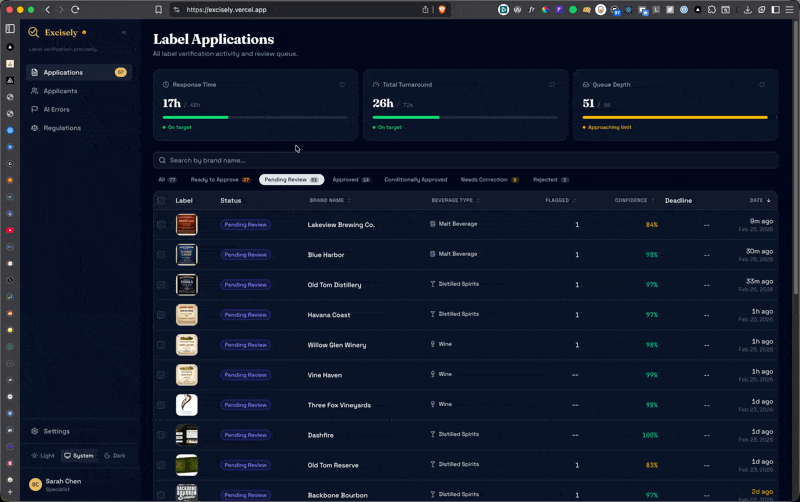
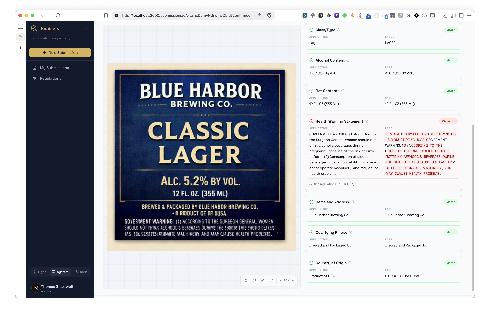
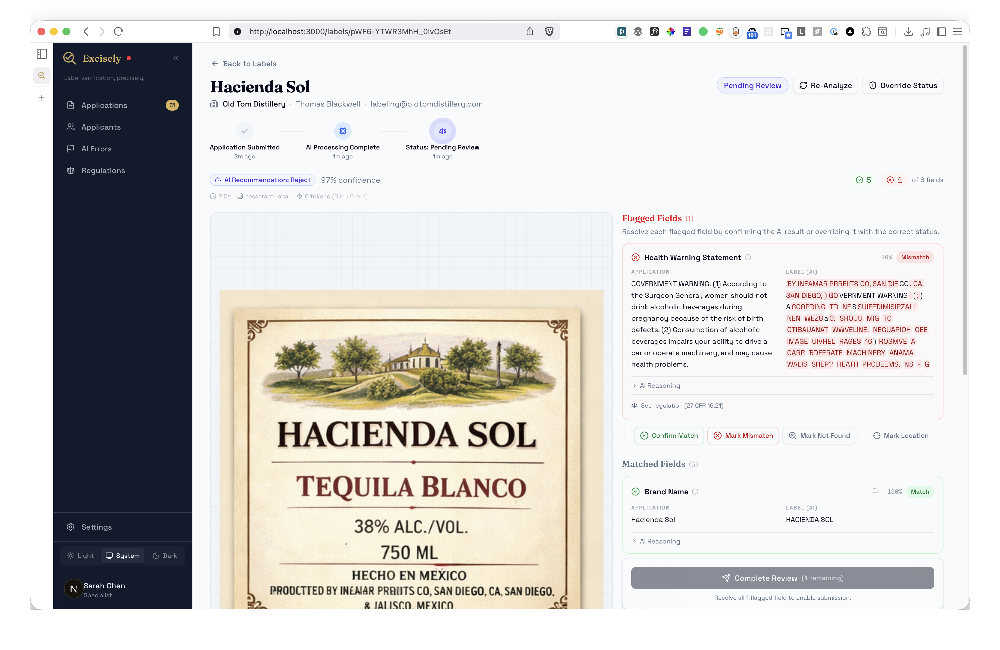
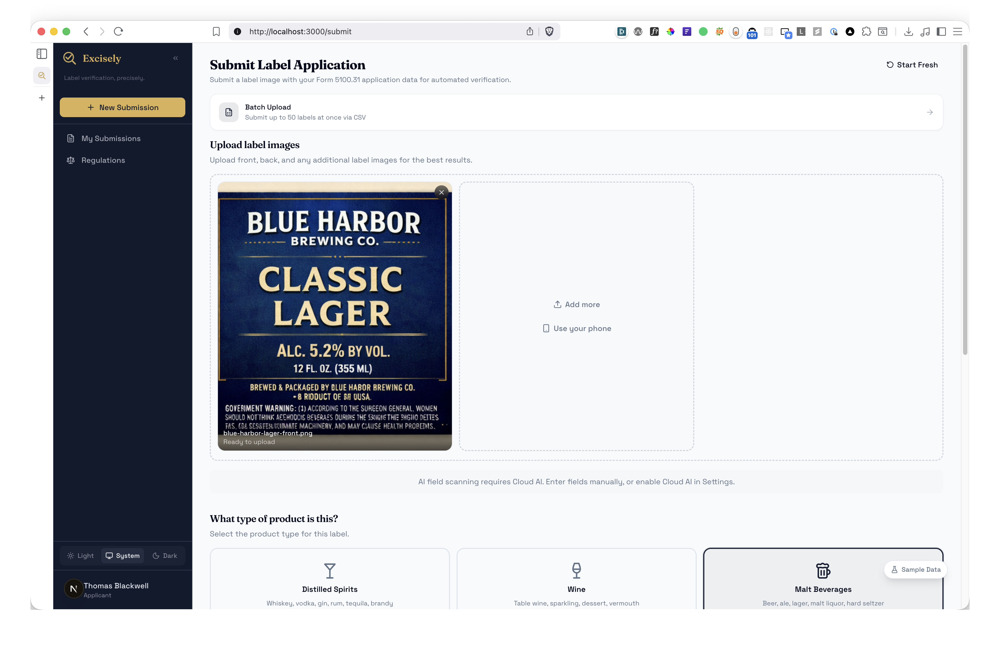
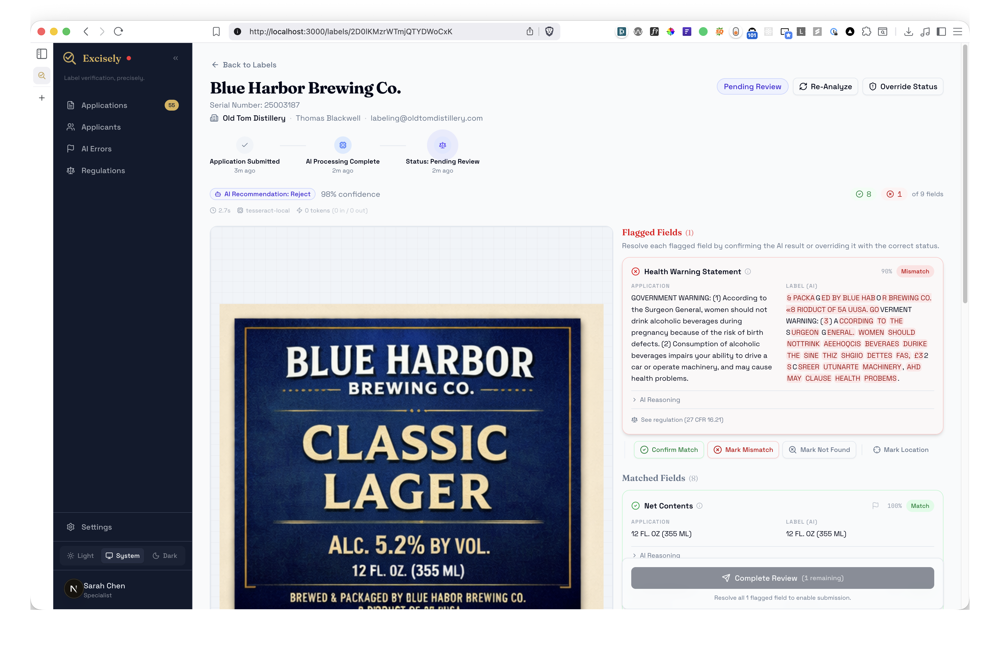
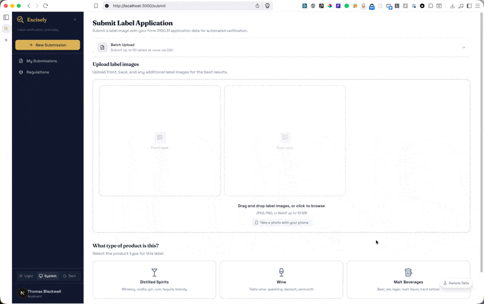
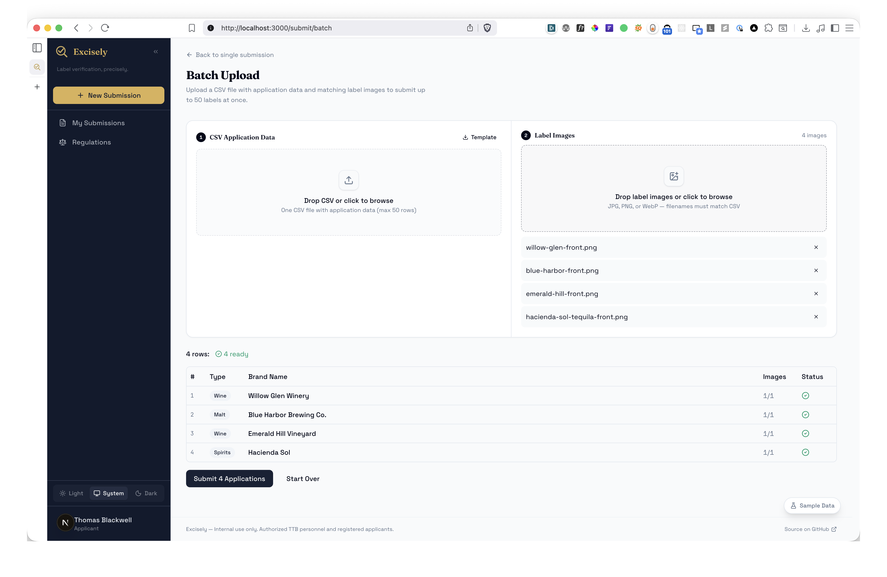
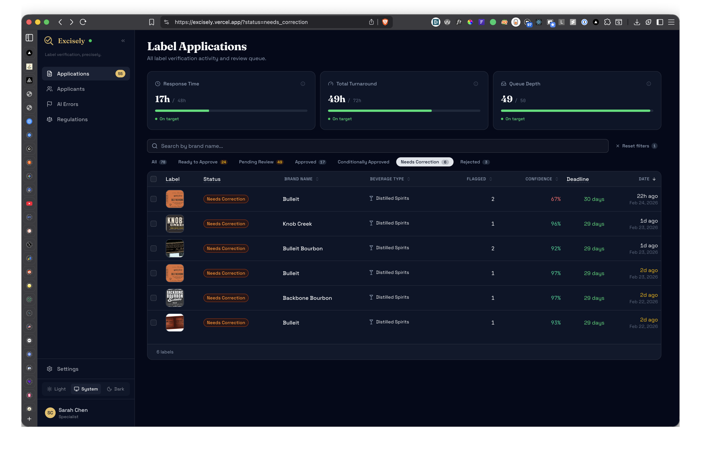
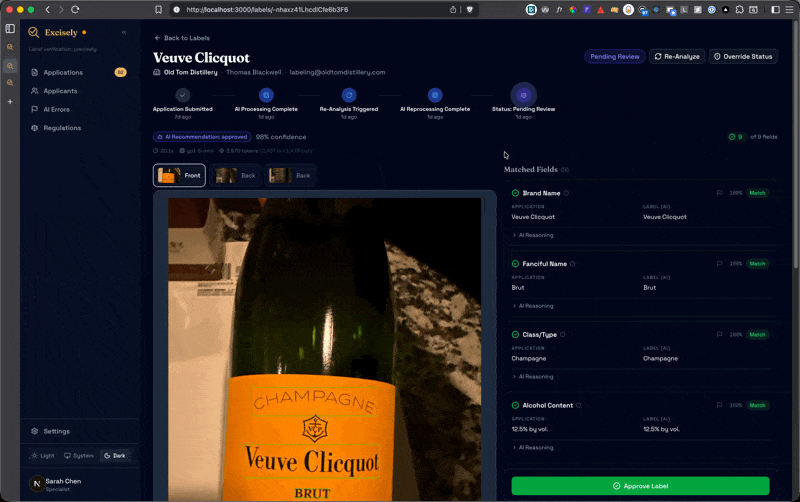

# Excisely — Submission Guide

**Label verification, precisely.** A tool that verifies alcohol label compliance against TTB Form 5100.31 application data using OCR + AI field classification.

**Live app:** [https://excisely.vercel.app](https://excisely.vercel.app)

---

## Quick Setup

```bash
git clone https://github.com/ryparker/excisely.git && cd excisely && yarn install
cp .env.example .env.local
docker compose up -d && yarn db:push && yarn db:seed && yarn dev
```

No API keys needed — the local pipeline works out of the box. Open [http://localhost:3000](http://localhost:3000).

### Test Accounts

| Role       | Email                         | Password      |
| ---------- | ----------------------------- | ------------- |
| Applicant  | labeling@oldtomdistillery.com | applicant123  |
| Specialist | sarah.chen@ttb.gov            | specialist123 |

---

## Requirements Checklist

Every bolded requirement from the task brief, how we met it, and where to see it in action.

### 1. "If we can't get results back in about 5 seconds, nobody's going to use it."

_— Sarah Chen, Deputy Director_

**How we met it:** The local pipeline (Tesseract.js OCR + rule-based classification) processes labels in ~2-4 seconds with zero API calls. I went further by moving verification to the applicant's submission step — so by the time a specialist opens a label, the analysis is already done. Specialist wait time is zero.

A cloud AI pipeline (Google Cloud Vision + OpenAI GPT-4.1 Nano) is also available as an opt-in upgrade for higher accuracy and bounding box overlays, processing in ~3-5 seconds.


---

### 2. "Something my mother could figure out"

_— Sarah Chen, on agent demographics (half the team is over 50)_

**How we met it:** Clean, minimal UI with no hidden controls. Large click targets, obvious primary actions, consistent layout across every page. The applicant flow is three steps: fill in form fields (or use "Sample Data"), upload images, submit. The specialist flow is: open a label, see the analysis side-by-side with the label image, approve or reject. No hunting for buttons — the primary action is always the most prominent element on the page.

Fully responsive — works on phones and tablets. Applicants can snap photos of bottles from their camera and submit on the go.



---

### 3. "Handle batch uploads"

_— Sarah Chen, on peak season (200-300 labels at once from large importers)_

**How we met it:** Three batch features cover both sides of the workflow:

- **Batch submission (applicant)** — `/submit/batch` lets applicants upload a CSV file (one row per COLA application) alongside label images, then submit up to 50 applications at once. Client-side CSV parsing with instant validation, a preview table showing ready/error status per row, real-time progress during processing (`p-limit(3)` concurrency), and a results summary with retry-failed capability. Uses the same AI validation pipeline as single submissions.
- **Batch approval (specialist)** — Filter the dashboard to "Ready to Approve" (high-confidence labels where all fields match), select multiple labels with checkboxes, and approve them all in one click with optimistic UI updates.
- **Batch re-analyze (specialist)** — Select multiple labels and re-run OCR + field comparison in bulk (useful after switching pipeline models or when images are re-uploaded).

Batch Upload (applicant):


Batch Approval (specialist):



---

### 4. "The warning statement check is actually trickier than it sounds. It has to be exact."

_— Jenny Park, on health warning verification_

**How we met it:** The health warning gets the strictest treatment in the system. It's a mandatory field for all beverage types (beer, wine, distilled spirits), and the comparison engine checks:

- **Exact text match** (word-for-word after whitespace normalization)
- **Case verification** — "GOVERNMENT WARNING:" must be ALL CAPS (catches Jenny's "title case" scenario)
- **Character-level diff highlighting** — the review page shows red/green inline diffs so specialists see precisely which characters differ
- **Garbled OCR detection** — the pipeline verifies that key phrases ("surgeon general", "pregnancy", "birth defects", "drive a car", "operate machinery", "health problems") are actually legible in the OCR output, rather than just trusting the "GOVERNMENT WARNING" prefix
- **CFR citations** — regulation tooltips on the field label link to the relevant 27 CFR Part 16 sections (16.21-16.22)

The required text is codified in `src/config/health-warning.ts` with both sections and validation rules per 27 CFR 16.21-16.22.



---

### 5. Core label fields (Brand Name, Class/Type, Alcohol Content, Net Contents, Name & Address, Country of Origin)

_— Technical Requirements: "check that what's on the label matches what's in the application"_

**How we met it:** The AI pipeline extracts and compares all standard TTB fields with field-appropriate matching strategies:

| Field             | Strategy                 | Why                                 |
| ----------------- | ------------------------ | ----------------------------------- |
| Brand Name        | Fuzzy (Dice coefficient) | OCR typos, decorative fonts         |
| Class/Type        | Fuzzy                    | Stylized text, abbreviations        |
| Alcohol Content   | Normalized               | "45% Alc./Vol." vs "45% ALC BY VOL" |
| Net Contents      | Normalized               | "750 mL" vs "750ML"                 |
| Health Warning    | Exact                    | Must be word-for-word per 27 CFR    |
| Name & Address    | Fuzzy                    | Multi-line, OCR line breaks         |
| Country of Origin | Fuzzy                    | Abbreviation variations             |

Each field shows a match/mismatch badge with confidence score, and the specialist can override any field.



---

### 6. "Our network blocks outbound traffic to a lot of domains, so keep that in mind if you're thinking about cloud APIs."

_— Marcus Williams, IT Systems Administrator, on government network restrictions_

**How we met it:** The app is **local-first by default**. Zero outbound API calls are needed — Tesseract.js OCR runs in-process, field classification is rule-based, and images are stored on the local filesystem. `docker compose up`, seed, and `yarn dev` gives you a fully functional app behind any firewall.

Cloud AI (Google Cloud Vision + OpenAI) is available as an opt-in upgrade for environments where outbound traffic is allowed — just add API keys and toggle it on in Settings. If a cloud call fails, the system automatically falls back to local.

---

### Deliverables

| Requirement                             | Status                                                                                          |
| --------------------------------------- | ----------------------------------------------------------------------------------------------- |
| Source code repository                  | [github.com/ryparker/excisely](https://github.com/ryparker/excisely)                            |
| README with setup/run instructions      | [README.md](./README.md) — Docker, seed, dev server (no API keys needed)                        |
| Documentation of approach & assumptions | This document + [architecture.md](./docs/architecture.md) + [decisions.md](./docs/decisions.md) |
| Deployed application URL                | [excisely.vercel.app](https://excisely.vercel.app)                                              |

---

## Quick Walkthrough

### Step 1: Submit as an Applicant

1. **Log in** as Thomas Blackwell (applicant)
2. Go to **Submit New Application** (sidebar or FAB button on mobile)
3. Click **"Sample Data"** to auto-fill with a distilled spirits example
4. Upload 1-4 label images (drag & drop or click to browse)
5. Review the values — correct anything that looks wrong
6. Click **"Submit Application"**
7. You'll see the proposed status (Approved, Needs Correction, etc.) immediately

For bulk workflows, try **Submit → Batch Upload** — upload a CSV (one row per application) alongside label images to submit up to 50 at once.



### Step 2: Review as a Specialist

1. **Log out**, then **log in** as Sarah Chen (specialist)
2. The **dashboard** shows all pending submissions with SLA metrics
3. Click any label to open the **review detail page**
4. You'll see:
   - **Field comparison table** with character-level diff highlighting
   - **AI's recommendation** and confidence scores
5. Override any field if the AI got it wrong, add reviewer notes
6. **Approve or reject** the label — your decision is final



---

## Interesting Scenarios to Try

These showcase the most impressive features. Each takes under a minute.

### 1. Submit from Your Phone

Log in as an applicant on your phone. The submit form is fully responsive — you can snap photos of real bottles directly from your camera, upload them, and submit on the go. Try it with any bottle from your kitchen.



### 2. Batch Submission + Approval

**As an applicant**, go to Submit → Batch Upload:

1. Download the **CSV template** (or click "Load all instantly" to use sample data)
2. Upload the CSV + label images — the preview table shows validation status per row
3. Click **"Submit N Applications"** — watch real-time progress as each row processes through the AI pipeline



**As a specialist** on the dashboard:

1. Filter to **"Ready to Approve"** — high-confidence labels where all fields match
2. Select multiple labels with checkboxes
3. Click **"Approve Selected"** — all approved instantly with optimistic UI updates

This is the full batch workflow Sarah Chen described — applicants submit in bulk, specialists approve in bulk.


### 3. Deadline Enforcement

Labels with "Needs Correction" get a 30-day deadline:

- Shows countdown timers on each label
- Automatically expires labels past their deadline (lazy evaluation, no cron jobs)
- Updates status from "Needs Correction" → "Rejected" when time runs out



### 4. Regulation Tooltips

Hover over any field label in the form or review page to see a tooltip with the relevant CFR citation. Click through to a built-in regulations reference page with plain-English summaries of each TTB requirement, with links to the official eCFR text. Both applicants and specialists can quickly verify why a field matters without leaving the app.



---

## Architecture at a Glance

```
Applicant uploads images
        ↓
┌─ Local (default): Tesseract.js OCR (in-process, ~1-2s)
│  OR
└─ Cloud (opt-in):  Google Cloud Vision OCR (word-level bounding boxes, <1s)
        ↓
┌─ Local: Rule-based field classification (~100ms)
│  OR
└─ Cloud: OpenAI GPT-4.1 Nano structured output (~2-4s)
        ↓
Comparison engine (field-appropriate: fuzzy, exact, normalized)
        ↓
Results with diff highlighting (+ bounding box overlays if cloud)
        ↓
Specialist reviews and makes final decision
```

**Speed:** ~2-5 seconds end-to-end depending on pipeline and number of images.

**Local-first:** Works out of the box with zero API keys. Cloud AI is opt-in via Settings for bounding box overlays, AI field scanning, and higher accuracy. Automatic fallback to local if a cloud call fails.

**Stack:** Next.js 16 (React 19, App Router) | TypeScript | Tailwind CSS v4 + shadcn/ui | Drizzle ORM + Postgres | Better Auth | Vitest (625+ tests)

---

## What I'd Build Next

Given more time, these are the features I'd prioritize:

- **Applicant resubmission** — When a label gets "Needs Correction," the applicant should be able to upload corrected images and resubmit against the same application, preserving the review history. Currently they'd need to start a new submission.
- **Email notifications** — Notify applicants when their label status changes (approved, needs correction, rejected) and notify specialists when new submissions arrive.
- **PDF export** — Generate a printable COLA certificate or rejection letter from the review results.

See [docs/production.md](./docs/production.md) for the full list of production readiness gaps (security, monitoring, rate limiting, FedRAMP compliance, etc.).

---

## Further Reading

| Document                                       | What's in it                                                  |
| ---------------------------------------------- | ------------------------------------------------------------- |
| [README.md](./README.md)                       | Setup instructions, quick start, commands                     |
| [docs/architecture.md](./docs/architecture.md) | System diagrams, data flow, DB schema, modules                |
| [docs/ai-pipelines.md](./docs/ai-pipelines.md) | AI pipeline deep dive — OCR, classification, matching         |
| [docs/cloud-ai.md](./docs/cloud-ai.md)         | Cloud AI features — bounding box overlays, AI pre-fill, costs |
| [docs/decisions.md](./docs/decisions.md)       | 26 engineering decisions with rationale                       |
| [docs/production.md](./docs/production.md)     | What I'd build for production (security, scale, ops)          |
| [docs/changelog.md](./docs/changelog.md)       | What changed and why, chronologically                         |
