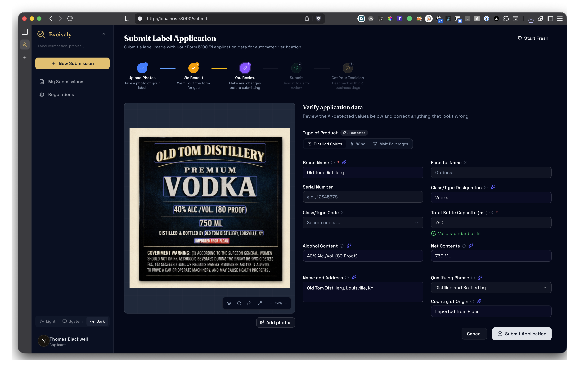
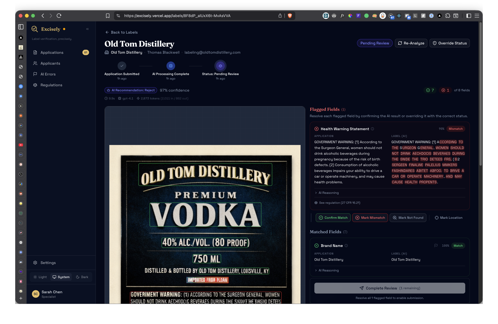
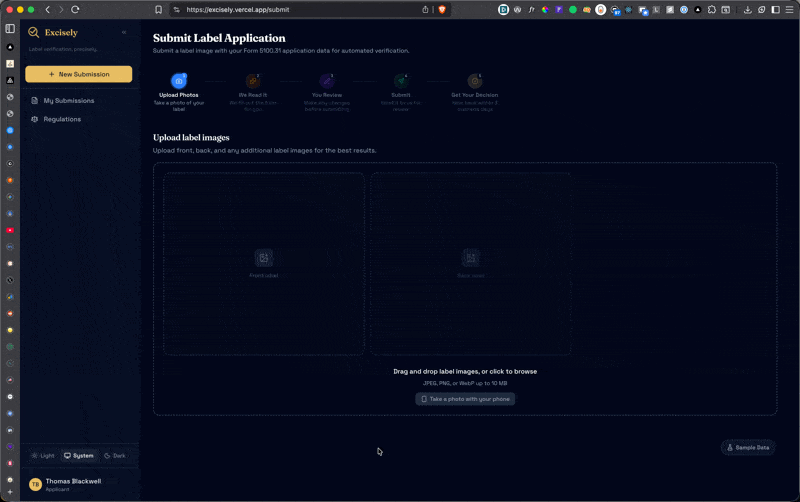
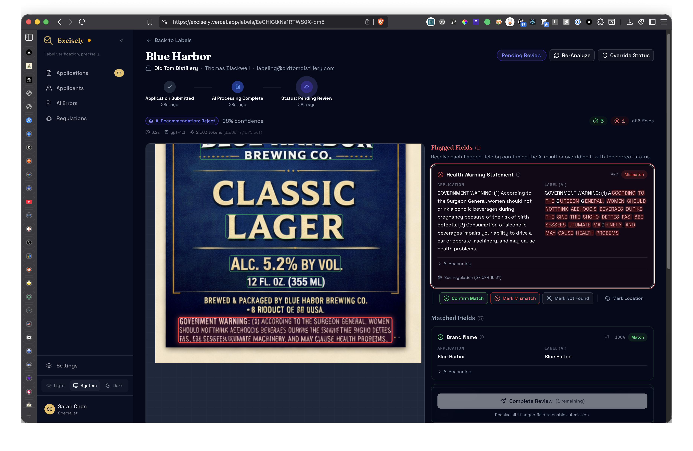
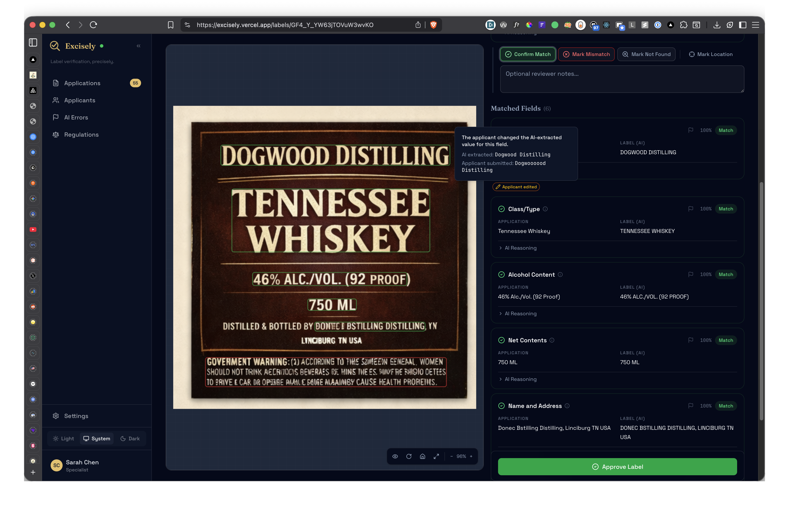

# Excisely — Submission Guide

**Label verification, precisely.** An AI-powered tool that verifies alcohol label compliance against TTB Form 5100.31 application data.

**Live app:** [https://excisely.vercel.app](https://excisely.vercel.app)

---

## The Big Idea

The task described a 5-second response time target for specialists. I went further: **I moved the AI verification to the applicant side**, so the specialist wait time is zero.

Here's how it works:

1. **Applicant uploads label images** and the AI instantly extracts all field values (brand name, ABV, health warning, etc.) and pre-fills the form
2. **Applicant reviews, corrects if needed, and submits** — gets instant feedback on whether the label passes verification
3. **Specialist opens the submission** — AI analysis is already complete. They see annotated images, field-by-field comparison, and the AI's recommendation. They decide to trust it or override it.

The specialist never waits for AI processing. The applicant gets instant feedback. Everyone wins.

| Applicant                                                       | Specialist                                                                 |
| --------------------------------------------------------------- | -------------------------------------------------------------------------- |
|  |  |

---

## Quick Walkthrough

### Test Accounts

| Role       | Email                         | Password      |
| ---------- | ----------------------------- | ------------- |
| Applicant  | labeling@oldtomdistillery.com | applicant123  |
| Specialist | sarah.chen@ttb.gov            | specialist123 |

### Step 1: Submit as an Applicant

1. **Log in** as Thomas Blackwell (applicant)
2. Go to **Submit New Application** (sidebar or FAB button on mobile)
3. Click **"Try Sample Data"** to auto-fill with a distilled spirits example
4. Upload 1-4 label images (drag & drop or click to browse)
5. Click **"Scan Labels"** — watch the AI extract text and pre-fill the form in ~5-9 seconds
6. Review the extracted values — correct anything the AI got wrong
7. Click **"Submit Application"**
8. You'll see the AI's proposed status (Approved, Needs Correction, etc.) immediately



### Step 2: Review as a Specialist

1. **Log out**, then **log in** as Sarah Chen (specialist)
2. The **dashboard** shows all pending submissions with SLA metrics
3. Click any label to open the **review detail page**
4. You'll see:
   - **Annotated label image** with color-coded bounding boxes (green = match, red = mismatch)
   - **Field comparison table** with character-level diff highlighting
   - **AI's recommendation** and confidence scores
5. Override any field if the AI got it wrong, add reviewer notes
6. **Approve or reject** the label — your decision is final



---

## Interesting Scenarios to Try

These showcase the most impressive features. Each takes under a minute.

### 1. Submit from Your Phone

Log in as an applicant on your phone. The submit form is fully responsive — you can snap photos of real bottles directly from your camera, upload them, and submit on the go. Try it with any bottle from your kitchen.

The Cloud Vision OCR handles curved text, reflections, glare, and artistic fonts — no need for perfectly flat scans.



### 2. Interactive Image Viewer

On any label detail page, try:

- **Click a field** in the comparison table — the image auto-pans and zooms to that exact region
- **Scroll to zoom**, drag to pan, toolbar buttons to rotate
- **Toggle overlays** on/off to see the clean label vs. annotated view
- **Expand to fullscreen** for detailed inspection

This is how a specialist would work through a label — click each field, verify it visually, move on.


### 3. Character-Level Diff on Health Warning

Submit a label where the health warning text has a minor difference (e.g., "Government Warning" in title case instead of "GOVERNMENT WARNING" in all caps). The review page shows:

- Exact character-level highlighting of what differs
- Red/green inline diff so the specialist sees precisely what's wrong

This catches the exact scenario Jenny Park described — applicants getting creative with warning statement formatting.



### 4. Batch Approval Queue

As a specialist on the dashboard:

1. Filter to **"Ready to Approve"** — these are high-confidence labels where all fields match
2. Select multiple labels with checkboxes
3. Click **"Approve Selected"** — all approved instantly with optimistic UI updates

This addresses the batch processing need Sarah Chen described for peak season (200-300 labels at once from large importers).


### 5. Applicant Corrections Tracking

1. As an applicant, scan a label and let the AI pre-fill
2. Change one value (e.g., fix the brand name spelling)
3. Submit the application
4. As a specialist, open that label — you'll see a badge showing what the AI originally extracted vs. what the applicant corrected

This gives specialists context: "The AI read it as X, but the applicant says it should be Y."



### 6. Deadline Enforcement

Labels with "Needs Correction" get a 30-day deadline. Labels with "Conditionally Approved" get 7 days. The system:

- Shows countdown timers on each label
- Automatically expires labels past their deadline (lazy evaluation, no cron jobs)
- Updates status from "Needs Correction" → "Rejected" when time runs out


---

## Architecture at a Glance

```
Applicant uploads images
        ↓
Google Cloud Vision OCR (word-level bounding boxes, <1s)
        ↓
OpenAI GPT-4.1 (field classification from OCR text, ~3-5s)
        ↓
Comparison engine (field-appropriate: fuzzy, exact, normalized)
        ↓
Annotated results with bounding boxes + diff highlighting
        ↓
Specialist reviews and makes final decision
```

**Speed:** ~5-9 seconds end-to-end (varies by number of images).

**A note on cloud APIs:** I recognize that a production TTB system may need to run on-premises or within a restricted network where external API calls aren't permitted. I built a fully local pipeline (Tesseract.js OCR + rule-based classification, zero outbound calls) as well — it's preserved on the `local-pipeline` branch. For this prototype, I chose the cloud pipeline to demonstrate the quality achievable with current models. As self-hosted models continue to improve, the same architecture would work with locally-hosted inference.

### Cost at Scale

At ~$0.004 per submission pipeline run and ~$0.002 per applicant pre-fill scan:

|                                                  | Per label   | 150,000 labels/year |
| ------------------------------------------------ | ----------- | ------------------- |
| Applicant pre-fill (Cloud Vision OCR + GPT-4.1)  | ~$0.002     | $300                |
| Submission pipeline (Cloud Vision OCR + GPT-4.1) | ~$0.004     | $600                |
| **Total**                                        | **~$0.006** | **~$900/year**      |

TTB processes ~150,000 label applications per year with 47 specialists. Full AI verification for every single one would cost roughly **$900/year** — about $19 per specialist per year.

**Stack:** Next.js 16 (React 19, App Router) | TypeScript | Tailwind CSS v4 + shadcn/ui | Drizzle ORM + Neon Postgres | Vercel Blob | Better Auth | Vitest (133 tests)

---

## What I'd Build Next

Given more time, these are the features I'd prioritize:

- **Applicant resubmission** — When a label gets "Needs Correction," the applicant should be able to upload corrected images and resubmit against the same application, preserving the review history. Currently they'd need to start a new submission.
- **Batch submission** — Large importers dump 200-300 labels at once (Sarah Chen's peak season scenario). Applicants should be able to drag in a folder of label images and submit them all in one flow, rather than one at a time.
- **Email notifications** — Notify applicants when their label status changes (approved, needs correction, rejected) and notify specialists when new submissions arrive.
- **PDF export** — Generate a printable COLA certificate or rejection letter from the review results.

See [docs/production.md](./docs/production.md) for the full list of production readiness gaps (security, monitoring, rate limiting, FedRAMP compliance, etc.).

---

## Further Reading

| Document                                       | What's in it                                          |
| ---------------------------------------------- | ----------------------------------------------------- |
| [README.md](./README.md)                       | Setup instructions, quick start, commands             |
| [docs/architecture.md](./docs/architecture.md) | System diagrams, data flow, DB schema, modules        |
| [docs/ai-pipelines.md](./docs/ai-pipelines.md) | AI pipeline deep dive — OCR, classification, matching |
| [docs/decisions.md](./docs/decisions.md)       | 14 engineering decisions with rationale               |
| [docs/production.md](./docs/production.md)     | What I'd build for production (security, scale, ops)  |
| [docs/changelog.md](./docs/changelog.md)       | What changed and why, chronologically                 |
